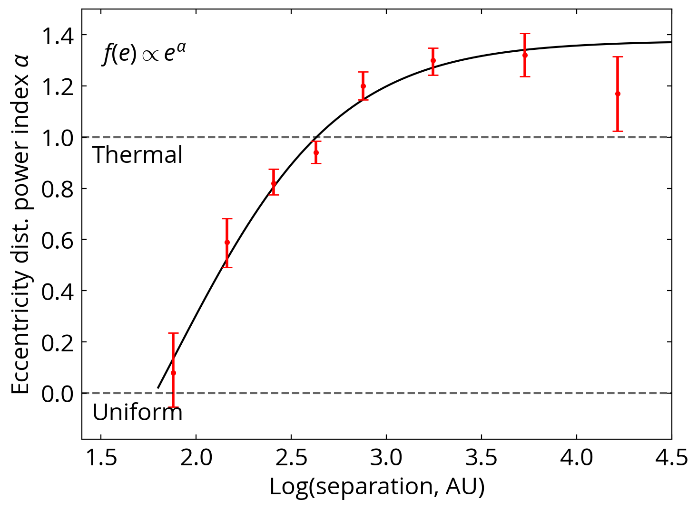
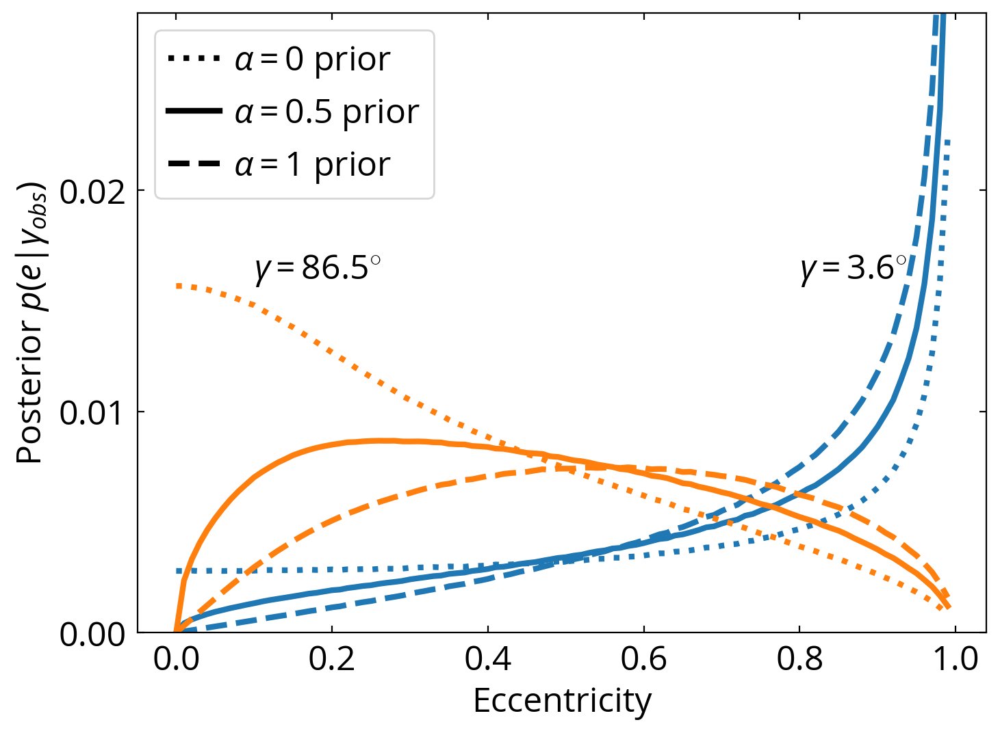

# Eccentricities of wide binaries

Here we provide the codes and the simulated data used in [Hwang et al. 2022a](https://ui.adsabs.harvard.edu/abs/2022MNRAS.512.3383H/abstract). In this paper, we developed a Bayesian method to infer the eccentricity of wide binaries from the v-r angle, the angle between the separation vector and the relative velocity vector. We also applied this technique to a special population called "twin wide binaries" and found them to be highly eccentric ([Hwang et al. 2022b](https://arxiv.org/abs/2205.05690)). A large fraction of the work is done by simulating binaries using the module `binary_sampling`.


With this method, below is the derived eccentricity distribution as a function of binary separations:


## binary_sampling

`binary_sampling` is a light-weighted module that samples the binaries with different eccentricities, orbital phases, orientation, (optional: bianry separations and distances). The module does not include orbital evolution calculation.

`binary_sampling` has two main classes, `binary()` and `binaries()`. `binary()` samples a single binary (i.e. single-value eccentricity, distance, etc.) with different orbital phase. Below is an example showing the v-r angle (the angle between the separation vector and the relative velocity vector) on binary orbits with different eccentricities (more detail can be found in `Demo 0 - Binary sampling.ipynb`):

```python
from binary_sampling import *

binary0 = binary(e=0., Nphase=5000)
plt.scatter(
    binary0.rx,
    binary0.ry,
    c=binary0.vr_angle,
    s=3,
    vmin=0., vmax=180., label='e=0'
)

binary1 = binary(e=0.9, Nphase=5000)
plt.scatter(
    binary1.rx,
    binary1.ry,
    c=binary1.vr_angle,
    s=3,
    vmin=0., vmax=180., label='e=0.9'
)

plt.colorbar(label=r'$v$-$r$ angle (deg)')

plt.scatter(
    [0], [0], c='k'
)

plt.axes().set_aspect('equal', 'datalim')
plt.xlabel('X')
plt.ylabel('Y')
plt.show()
```


## Pre-computed p(gamma|e) grid

In the file `Demo 1 - Using p(gamma|e) grid.ipynb`, we demonstrate the use of the pre-computed grid data for p(gamma|e), the v-r angle distribution given an eccentricity. The grid is computed using `binary_sampling` for eccentricity from 0 to 0.99, with a step of 0.01. The grid data in located in folder "grid_data".

## Infer eccentricities for individual wide binaries

In the file `Demo 2 - Infer eccentricities for individual wide binaries.ipynb`, we provide the procedure to compute the probability distribution function (PDF) for individual eccentricities. With this, we know something about individual eccentricities (notice that these wide binaries can have orbital periods as long as 1 Myr)!! We provide the measurement summary of these eccentricity PDF for all eDR3 wide binaries [here](https://drive.google.com/file/d/1h1pgexHUTpvE80PWCh6m1zY3QMMuYPnd/view).



## Reference
[Hwang, Ting & Zakamska, 2022, MNRAS](https://ui.adsabs.harvard.edu/abs/2022MNRAS.512.3383H/abstract)

[Hwang, El-Badry, Rix, Hamilton, Ting, & Zakamska, 2022, ApJL, accepted](https://arxiv.org/abs/2205.05690)
