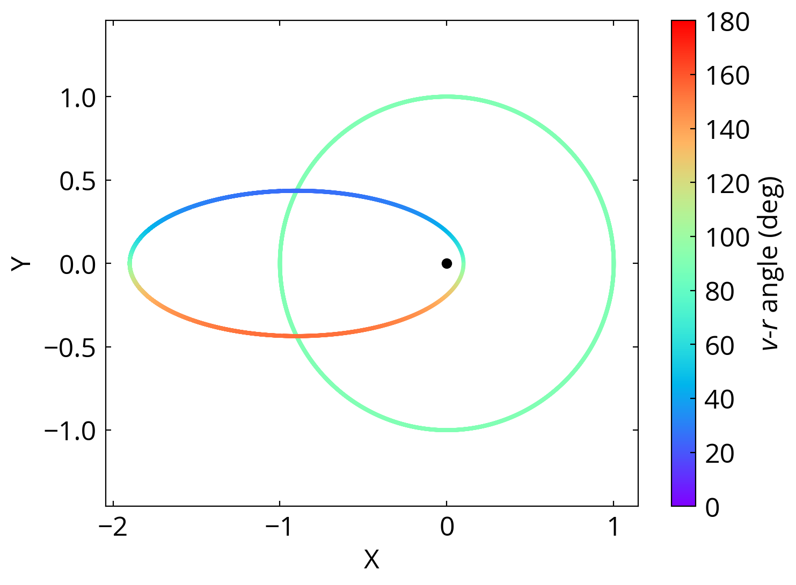

# Eccentricities of wide binaries

Here we provide the codes and the simulated data used in Hwang et al. (in prep.). In this paper, we developed a Bayesian method to infer the eccentricity of wide binaries from the v-r angle, the angle between the separation vector and the relative velocity vector. A large fraction of the work requires simulating binaries using the module `binary_sampling`.


## binary_sampling

`binary_sampling` is a light-weighted module that samples the binaries with different eccentricities, orbital phases, orientation, (optional: bianry separations and distances). The module does not include orbital evolution calculation.

`binary_sampling` has two main classes, `binary()` and `binaries()`. `binary()` samples a single binary (i.e. single-value eccentricity, distance, etc.) with different orbital phase. Below is an example showing the v-r angle (the angle between the separation vector and the relative velocity vector) on binary orbits with different eccentricities (more detail can be found in `Demo 0 - Binary sampling.ipynb`):

```python
from binary_sampling import *

binary0 = binary(e=0., Nphase=5000)
plt.scatter(
    binary0.rx,
    binary0.ry,
    c=binary0.vr_angle,
    s=3,
    vmin=0., vmax=180., label='e=0'
)

binary1 = binary(e=0.9, Nphase=5000)
plt.scatter(
    binary1.rx,
    binary1.ry,
    c=binary1.vr_angle,
    s=3,
    vmin=0., vmax=180., label='e=0.9'
)

plt.colorbar(label=r'$v$-$r$ angle (deg)')

plt.scatter(
    [0], [0], c='k'
)

plt.axes().set_aspect('equal', 'datalim')
plt.xlabel('X')
plt.ylabel('Y')
plt.show()
```


## Pre-computed p(gamma|e) grid

In the file `Demo 1 - Using p(gamma|e) grid.ipynb`, we demonstrate the use of the pre-computed grid data for p(gamma|e), the v-r angle distribution given an eccentricity. The grid is computed using `binary_sampling` for eccentricity from 0 to 0.99, with a step of 0.01. The grid data in located in folder "grid_data".

## Reference
Hwang, Ting & Zakamska (in prep.)
